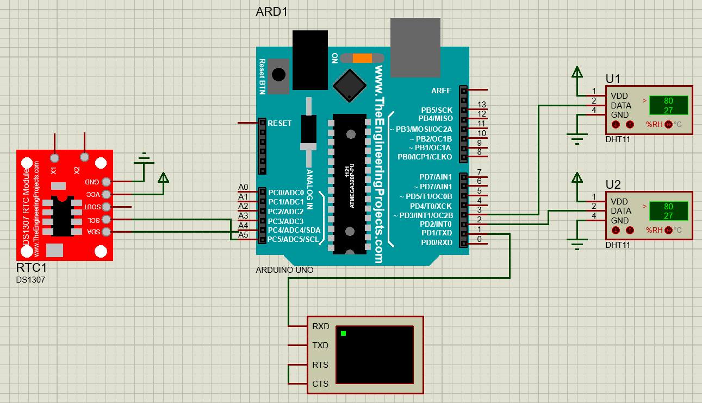
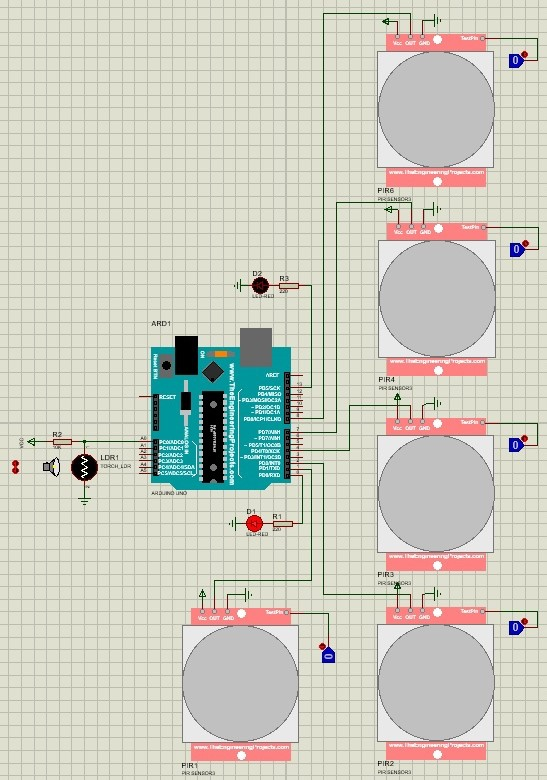
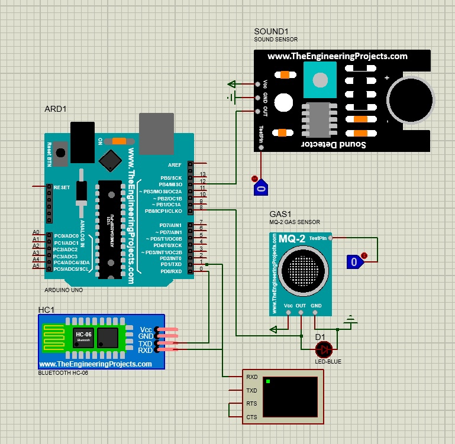

# Общие сведения
Работы выполнены в следующих системах:
 * В **Proteus** (система автоматизированного проектирования) создана модель взаимосвязи электронных компонентов, необходимых для выполнения задачи.
 * **Arduino IDE** — интегрированная среда разработки для Windows, MacOS и Linux, предназначенная для создания и загрузки программ на Arduino-совместимые платы, а также на платы других производителей. В этой среде разработан скрипт, который будет регулировать работу датчиков и остальных элементов цепи.
# Задание 1
## Цель работы
Реализовать схему передачи значений датчиков на персональный компьютер по проводному соединению USB.

## Исходные данные
На складе медикаментов производится постоянный мониторинг температуры и влажности. Данные от датчиков считываются каждые 5 секунд и передаются на персональный компьютер, который условно считается сервером микроклимата. В каждом отсчете указывается дата, время, значение влажности и температуры. 

## Схема Proteus


## Скетч Arduino
```
#include <DHT.h>
#include <Time.h>
#include <DS1307RTC.h>
#define DHT1PIN 2
#define DHT2PIN 3

DHT dht1(DHT1PIN, DHT11);
DHT dht2(DHT2PIN, DHT11);

void setup() {
  dht1.begin(); //1 датчик
  dht2.begin(); //2 датчик
  Serial.begin(9600);

  while (!Serial) ; //Ожидание чтения
  setSyncProvider(RTC.get);   //Синхронизация RTC времени
  if(timeStatus()!= timeSet) 
     Serial.println("Unable to sync with the RTC");
  else
     Serial.println("RTC has set the system time");     
}

void loop() {
  //Первый датчик
  float h1 = dht1.readHumidity();
  float t1 = dht1.readTemperature();

  //Второй датчик
  float h2 = dht2.readHumidity();
  float t2 = dht2.readTemperature();

  Serial.print("\r\nDate: ");
  Serial.print(day());
  Serial.print(".");
  Serial.print(month());
  Serial.print(".");
  Serial.print(year());
  
  Serial.print("\r\nTime: ");
  Serial.print(hour());
  printDigits(minute());
  printDigits(second());

  Serial.print("\r\nSensor 1: ");
  Serial.print("  Humidity: ");
  Serial.print(h1);
  Serial.print("%");
  Serial.print("  Temperature:");
  Serial.print(t1);
  Serial.print("C");

  Serial.print("\r\nSensor 2: ");
  Serial.print("  Humidity: ");
  Serial.print(h2);
  Serial.print("%");
  Serial.print("  Temperature:");
  Serial.print(t2);
  Serial.print("C");

  delay(5000);
}

void printDigits(int digits){
  //Функция преобразования времени
  Serial.print(":");
  if(digits < 10)
    Serial.print('0');
  Serial.print(digits);
}
```

# Задание 2
## Цель работы
Проектирование относительно недорогой конкурентоспособной системы управления освещением мест общего пользования жилого дома.

## Исходные данные
**Место эксплуатации системы:** подъезд и лестничные площадки 5-ти этажного дома.

**Сценарий**: необходимо организовать два режима работы дневной и ночной. В ночном режиме свет включается на всех лестничных площадках при наличии людей в подъезде, например, когда человек заходит в подъезд или выходит из квартиры. После того, как человек выйдет из подъезда или зайдет в квартиру, свет должен гаснуть через 10 сек (при моделировании в Proteus лучше уста-новить меньшее время, около 0,5 с). В дневное время свет включается только на первом этаже при входе в подъезд, так же при наличии людей. На меж-этажных площадках имеются окна и дневного освещения достаточно.


## Схема Proteus


## Скетч Arduino
```
int lightD1 = 0;
int lightD25 = 13;
int movePinD1 = 1;
int movePinD2 = 2;
int movePinD3 = 4;
int movePinD4 = 7;
int movePinD5 = 8;

int lightValue = 0;
int brightConst = 300; //контстанта освещённости
void setup() {

  pinMode (lightD1, OUTPUT);
  pinMode (lightD25, OUTPUT);
  pinMode (movePinD1, INPUT);
  pinMode (movePinD2, INPUT);
  pinMode (movePinD3, INPUT);
  pinMode (movePinD4, INPUT);
  pinMode (movePinD5, INPUT);
}
void loop() {
  lightValue = analogRead(A0);  
  movePinD1 = digitalRead(1);
  movePinD2 = digitalRead(2);
  movePinD3 = digitalRead(4);
  movePinD4 = digitalRead(7);
  movePinD5 = digitalRead(8); 

  if (lightValue < brightConst){
    // День
    if(movePinD1 == HIGH){
        digitalWrite (lightD1, HIGH); //вкл
        delay(500); //ожидание
    }
    else{
      digitalWrite (lightD1, LOW); // выкл 1 светодиод 
      digitalWrite (lightD25, LOW); // выкл 2 светодиод 
    }
  }
  else{
    // Ночь 
    if(movePinD1 == HIGH || movePinD2 == HIGH || movePinD3 == HIGH || movePinD4 == HIGH || movePinD5 == HIGH){
        digitalWrite (lightD1, HIGH); // вкл 1 этаж
        digitalWrite (lightD25, HIGH); // вкл  свет на 2-5 этажах
        delay(500); //ожидание
    }else{
        digitalWrite (lightD1, LOW); 
        digitalWrite (lightD25, LOW); 
    }
  }
}
```

# Задание 3
## Цель работы
Реализовать схему передачи значений датчиков на персональный компьютер по беспроводному соединению Bluetooth.

## Исходные данные
Имеется производственное помещение, например, заводской цех. По требованиям охраны труда необходимо контролировать вредные факторы условий для персонала. Мониторингу подлежат наличие вредных веществ в воздухе и уровень шума. Результаты мониторинга фиксируются на сервере. Отправка данных производится в виде текстовых сообщений на персональный компьютер по беспроводному соединению Bluetooth.

***Примечание!*** Для контроля наличия вредных веществ в воздухе можно использовать датчики обнаружения газа и дыма (например, серии MQ). Уровень шума измеряется любым датчиком звука.


## Схема Proteus


## Скетч Arduino
```
#define MQPIND1 8
#define SOUNDPIND 12

void setup() {
  Serial.begin(9600);
  
  pinMode (MQPIND1, INPUT);
  pinMode (SOUNDPIND, INPUT);
}

void loop(){
  if (digitalRead(MQPIND1) == HIGH) {
    Serial.print("\r\nGas level exceeded");
  }
  
  if (digitalRead(SOUNDPIND) == HIGH) {
    Serial.print("\r\nNoise level exceeded");
  }
}
```
